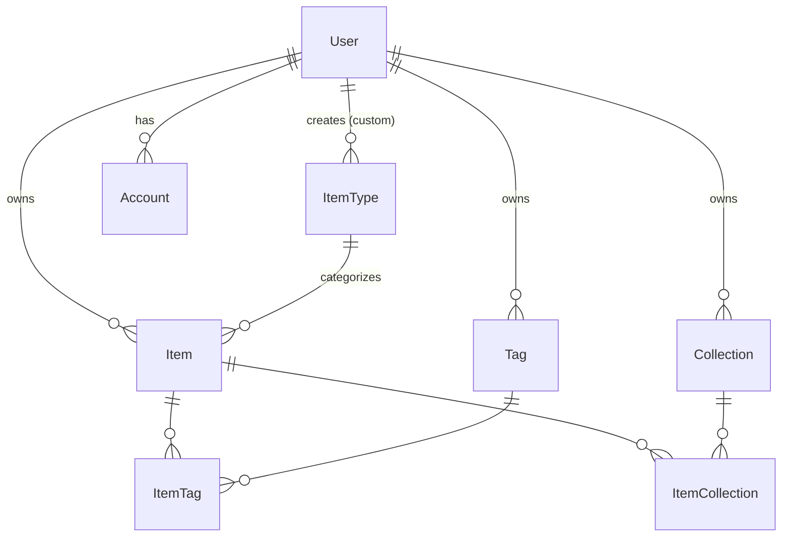
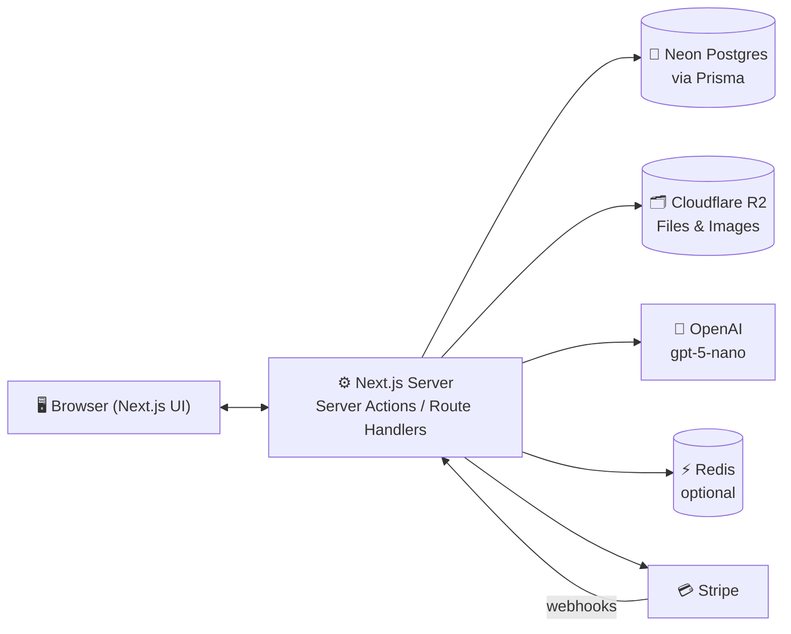
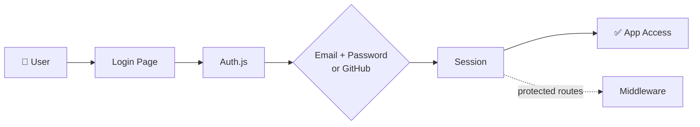
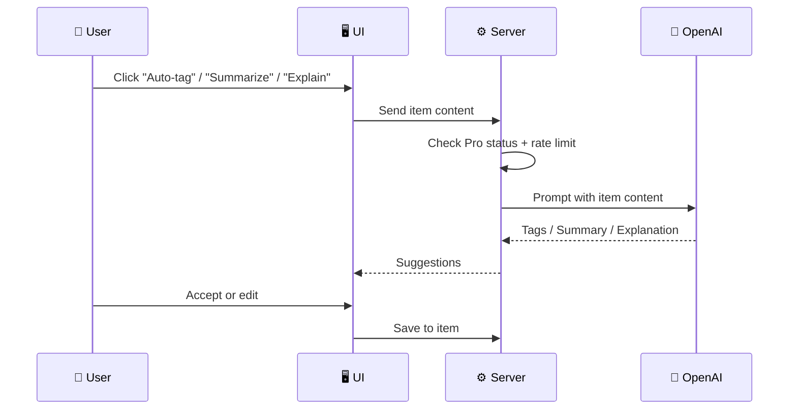
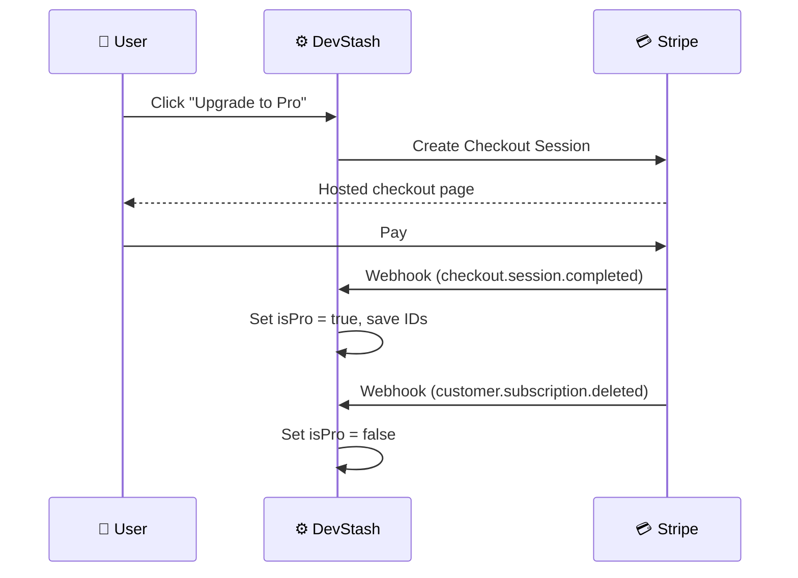
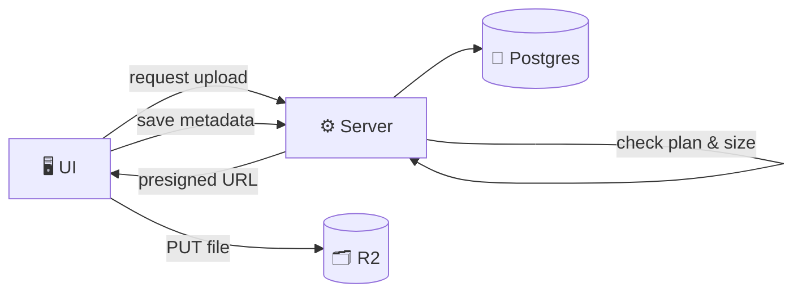

# 🗃️ DevStash — Project Overview

> **Store Smarter. Build Faster.**
> A centralized, AI‑enhanced knowledge hub for developers: code snippets, AI prompts, notes, commands, files, images and links — all in one searchable place.

| | |
| --- | --- |
| **Status** | 🟡 Planning — ready for environment setup & UI scaffolding |
| **Type** | SaaS (Free + Pro subscription) |
| **Stack** | Next.js · TypeScript · Prisma · Neon Postgres · Tailwind v4 · shadcn/ui · Auth.js · Stripe · Cloudflare R2 · OpenAI |

---

## 📑 Table of Contents

1. [Problem](#-problem)
2. [Target Users](#-target-users)
3. [Core Features](#-core-features)
4. [Item Types](#-item-types)
5. [Data Model (Rough Draft)](#️-data-model-rough-draft)
6. [Tech Stack](#-tech-stack)
7. [Architecture](#-architecture)
8. [Monetization](#-monetization)
9. [UI / UX](#-ui--ux)
10. [Project Structure](#-suggested-project-structure)
11. [Environment Variables](#-environment-variables)
12. [Development Workflow](#️-development-workflow)
13. [Roadmap](#-roadmap)
14. [Open Questions](#-open-questions)
15. [Resources](#-resources)

---

## 📌 Problem

Developers keep their essentials scattered across too many places:

| What | Where it usually lives |
| --- | --- |
| Code snippets | VS Code, Notion, random files |
| AI prompts | Buried in chat histories |
| Context files | Hidden inside individual projects |
| Useful links | Browser bookmarks |
| Docs | Random folders |
| Commands | `.txt` files, bash history |
| Project templates | GitHub Gists |

The result: **context switching, lost knowledge and inconsistent workflows.**

➡️ **DevStash provides ONE searchable, AI‑enhanced hub for all dev knowledge and resources.**

---

## 🧑‍💻 Target Users

| Persona | Needs |
| --- | --- |
| 👨‍💻 **Everyday Developer** | Quick access to snippets, commands and links |
| 🤖 **AI‑First Developer** | Store and reuse prompts, workflows and context files |
| 🎓 **Content Creator / Educator** | Save course notes and reusable code |
| 🏗️ **Full‑Stack Builder** | Patterns, boilerplates and API references |

---

## ✨ Core Features

### A) Items
The core unit of DevStash. Every item has a **type** (see [Item Types](#-item-types)), a title, optional description, tags, and either text content, a file, or a URL.

- Built‑in **system types** available to everyone
- **Custom types** for Pro users (own name, icon and color)

### B) Collections
Group related items together. Collections can hold **mixed item types**.

> Examples: `React Patterns`, `Context Files`, `Python Snippets`, `Interview Prep`

### C) Search
Full‑text search across **titles, content, tags and types**, with filters for type, collection, favorites and tags.

### D) Authentication
- Email + password
- GitHub OAuth

### E) Productivity
- ⭐ Favorites and 📌 pinned items
- 🕒 Recently used
- ⌨️ Keyboard‑first navigation (command palette, `⌘K`)
- 📋 One‑click copy for snippets, prompts and commands
- 📝 Markdown editor for text items
- 🎨 Syntax highlighting for code
- 📥 Import from files
- 📤 Export (JSON / ZIP) — Pro
- 🌙 Dark mode by default

### F) 🧠 AI Superpowers (Pro)
| Feature | Description |
| --- | --- |
| 🏷️ Auto‑tagging | Suggests tags based on item content |
| 📄 AI Summaries | Short summaries for long notes and docs |
| 💡 Explain Code | Plain‑English explanation of a snippet |
| ✨ Prompt Optimizer | Rewrites prompts to be clearer and more effective |

> Powered by **OpenAI `gpt-5-nano`** — cheap and fast, well suited to short tagging/summary tasks.

---

## 🧩 Item Types

System types are seeded into the database with `isSystem = true` and `userId = null`. Icons are from [Lucide](https://lucide.dev/icons/) (the default icon set for shadcn/ui).

| Type | Content kind | Icon (Lucide) | Color | Plan |
| --- | --- | --- | --- | --- |
| Snippet | text | `Code` | `#3b82f6` 🔵 | Free |
| Prompt | text | `Sparkles` | `#8b5cf6` 🟣 | Free |
| Note | text | `StickyNote` | `#fde047` 🟡 | Free |
| Command | text | `Terminal` | `#f97316` 🟠 | Free |
| URL | url | `Link` | `#10b981` 🟢 | Free |
| Image | file | `Image` | `#ec4899` 🩷 | Free |
| File | file | `File` | `#6b7280` ⚪ | Pro |

> URL: `/items/{type}` e.g. `/items/snippets`, `/items/commands`

---

## 🗄️ Data Model (Rough Draft)

> ⚠️ **This schema is a rough draft and a starting point — it will evolve during development.**

Changes from the original notes:
- Added the **Auth.js adapter models** (`Account`, `Session`, `VerificationToken`) and `name`/`image`/`emailVerified` on `User`
- Added an `ContentType` **enum** instead of a free‑form string
- Changed Item ↔ Collection to **many‑to‑many** (`ItemCollection`) so one item can live in several collections
- Added `lastUsedAt` to power **Recently used**
- Added **cascade deletes**, **unique constraints** and **indexes**

```prisma
// ⚠️ ROUGH DRAFT — will evolve

generator client {
  provider = "prisma-client-js"
}

datasource db {
  provider = "postgresql"
  url      = env("DATABASE_URL")
}

enum ContentType {
  TEXT
  FILE
  URL
}

model User {
  id                   String    @id @default(cuid())
  name                 String?
  email                String    @unique
  emailVerified        DateTime?
  image                String?
  password             String?   // hashed; null for OAuth-only users

  // Billing
  isPro                Boolean   @default(false)
  stripeCustomerId     String?   @unique
  stripeSubscriptionId String?   @unique

  accounts    Account[]
  sessions    Session[]
  items       Item[]
  itemTypes   ItemType[]
  collections Collection[]
  tags        Tag[]

  createdAt DateTime @default(now())
  updatedAt DateTime @updatedAt
}

model Item {
  id          String      @id @default(cuid())
  title       String
  description String?
  contentType ContentType @default(TEXT)

  // TEXT types (snippet, prompt, note, command)
  content  String?
  language String?        // e.g. "typescript", used for syntax highlighting

  // FILE types (file, image) — stored in Cloudflare R2
  fileUrl  String?
  fileName String?
  fileSize Int?           // bytes

  // URL type
  url String?

  isFavorite Boolean   @default(false)
  isPinned   Boolean   @default(false)
  lastUsedAt DateTime?

  userId String
  user   User   @relation(fields: [userId], references: [id], onDelete: Cascade)

  typeId String
  type   ItemType @relation(fields: [typeId], references: [id])

  tags        ItemTag[]
  collections ItemCollection[]

  createdAt DateTime @default(now())
  updatedAt DateTime @updatedAt

  @@index([userId])
  @@index([userId, typeId])
  @@index([userId, lastUsedAt])
}

model ItemType {
  id       String  @id @default(cuid())
  name     String
  icon     String? // Lucide icon name
  color    String? // hex
  isSystem Boolean @default(false)

  userId String? // null for system types
  user   User?   @relation(fields: [userId], references: [id], onDelete: Cascade)

  items Item[]

  @@unique([userId, name])
}

model Collection {
  id          String  @id @default(cuid())
  name        String
  description String?
  isFavorite  Boolean @default(false)

  userId String
  user   User   @relation(fields: [userId], references: [id], onDelete: Cascade)

  items ItemCollection[]

  createdAt DateTime @default(now())
  updatedAt DateTime @updatedAt

  @@index([userId])
}

model ItemCollection {
  itemId       String
  collectionId String
  addedAt      DateTime @default(now())

  item       Item       @relation(fields: [itemId], references: [id], onDelete: Cascade)
  collection Collection @relation(fields: [collectionId], references: [id], onDelete: Cascade)

  @@id([itemId, collectionId])
}

model Tag {
  id     String @id @default(cuid())
  name   String

  userId String
  user   User   @relation(fields: [userId], references: [id], onDelete: Cascade)

  items ItemTag[]

  @@unique([userId, name])
}

model ItemTag {
  itemId String
  tagId  String

  item Item @relation(fields: [itemId], references: [id], onDelete: Cascade)
  tag  Tag  @relation(fields: [tagId], references: [id], onDelete: Cascade)

  @@id([itemId, tagId])
}

// ---------- Auth.js (NextAuth v5) Prisma adapter models ----------

model Account {
  userId            String
  type              String
  provider          String
  providerAccountId String
  refresh_token     String?
  access_token      String?
  expires_at        Int?
  token_type        String?
  scope             String?
  id_token          String?
  session_state     String?

  user User @relation(fields: [userId], references: [id], onDelete: Cascade)

  createdAt DateTime @default(now())
  updatedAt DateTime @updatedAt

  @@id([provider, providerAccountId])
}

model Session {
  sessionToken String   @unique
  userId       String
  expires      DateTime
  user         User     @relation(fields: [userId], references: [id], onDelete: Cascade)

  createdAt DateTime @default(now())
  updatedAt DateTime @updatedAt
}

model VerificationToken {
  identifier String
  token      String
  expires    DateTime

  @@id([identifier, token])
}
```

### Entity Relationships



---

## 🧱 Tech Stack

| Category | Choice | Notes |
| --- | --- | --- |
| ⚛️ Framework | [Next.js](https://nextjs.org/docs) (App Router, React 19) | Server Components + Server Actions |
| 🟦 Language | [TypeScript](https://www.typescriptlang.org/docs/) | Strict mode |
| 🐘 Database | [Neon](https://neon.tech/docs) PostgreSQL | Serverless Postgres, branching per lesson/PR |
| 🔺 ORM | [Prisma](https://www.prisma.io/docs) | Migrations + seed for system types |
| ⚡ Caching | [Redis](https://upstash.com/docs/redis/overall/getstarted) (optional) | e.g. Upstash for rate limiting AI calls |
| 🗂️ File Storage | [Cloudflare R2](https://developers.cloudflare.com/r2/) | S3‑compatible, no egress fees; presigned uploads |
| 🎨 CSS / UI | [Tailwind CSS v4](https://tailwindcss.com/docs) + [shadcn/ui](https://ui.shadcn.com/) | Icons via [Lucide](https://lucide.dev/) |
| 🔐 Auth | [Auth.js / NextAuth v5](https://authjs.dev/) | Credentials + GitHub providers |
| 🧠 AI | [OpenAI API](https://platform.openai.com/docs) — `gpt-5-nano` | Pro only, rate‑limited |
| 💳 Payments | [Stripe](https://docs.stripe.com/billing/subscriptions/overview) | Checkout, Customer Portal, webhooks |
| ✅ Validation | [Zod](https://zod.dev/) | Shared schemas for forms & server actions |
| 🖍️ Code highlighting | [Shiki](https://shiki.style/) | VS Code‑quality highlighting |
| 🚀 Deployment | [Vercel](https://vercel.com/docs) | Likely |
| 🐞 Monitoring | [Sentry](https://docs.sentry.io/platforms/javascript/guides/nextjs/) | Added later |

---

## 🔌 Architecture

### System Overview



### 🔐 Auth Flow



### 🧠 AI Feature Flow



### 💳 Billing Flow



### 📤 File Upload Flow



---

## 💰 Monetization

| Plan | Price | Limits | Features |
| --- | --- | --- | --- |
| 🆓 **Free** | $0 | 50 items · 3 collections | All system types except File, image uploads, basic search |
| ⭐ **Pro** | $8/mo or $72/yr (save 25%) | Unlimited items & collections | File uploads, custom types, AI features, export (JSON/ZIP), priority support |

- Stripe Checkout for upgrades, Customer Portal for managing/cancelling
- Webhooks keep `isPro`, `stripeCustomerId` and `stripeSubscriptionId` in sync
- Limits are enforced **server‑side** (never trust the client)
- On downgrade: existing items stay readable; creating new items is blocked above the free limits

---

## 🎨 UI / UX

**Principles:** dark mode first · minimal · keyboard‑friendly · fast
**Inspiration:** [Notion](https://www.notion.so/), [Linear](https://linear.app/), [Raycast](https://www.raycast.com/)

### Layout

```
┌──────────────┬──────────────────────────────────────────┐
│ 🗃️ DevStash   │  🔍 Search (⌘K)            [+ New Item]  │
├──────────────┼──────────────────────────────────────────┤
│ TYPES        │  📌 Pinned                               │
│  Snippets    │  ┌────────┐ ┌────────┐ ┌────────┐        │
│  Prompts     │  │ card   │ │ card   │ │ card   │        │
│  Notes       │  └────────┘ └────────┘ └────────┘        │
│  Commands    │                                          │
│  Links       │  🕒 Recent                               │
│  Images      │  ┌────────┐ ┌────────┐ ┌────────┐        │
│  Files       │  │ card   │ │ card   │ │ card   │        │
│              │  └────────┘ └────────┘ └────────┘        │
│ COLLECTIONS  │                                          │
│  ⭐ React     │                                          │
│  Python      │                                          │
│              │                                          │
│ 👤 User      │                                          │
└──────────────┴──────────────────────────────────────────┘
```

- **Collapsible sidebar** with item types, collections and filters
- **Main workspace** with grid/list toggle; cards color‑coded by item type
- **Item drawer / full‑screen editor** for viewing and editing
- Syntax highlighting and one‑click copy on code items

### Responsive
- Sidebar becomes a **mobile drawer**
- Touch‑friendly icon buttons and tap targets

---

## 📁 Suggested Project Structure

```
devstash/
├── prisma/
│   ├── schema.prisma
│   └── seed.ts              # seeds system item types
├── src/
│   ├── app/
│   │   ├── (auth)/           # sign-in, register
│   │   ├── (dashboard)/      # items, collections, settings
│   │   └── api/
│   │       ├── auth/[...nextauth]/
│   │       └── webhooks/stripe/
│   ├── actions/              # server actions (items, collections, ai)
│   ├── components/
│   │   ├── ui/               # shadcn components
│   │   └── ...
│   ├── lib/                  # prisma, auth, stripe, r2, openai clients
│   └── types/
├── auth.ts
├── middleware.ts
└── .env
```

---

## 🔑 Environment Variables

```bash
# Database
DATABASE_URL=

# Auth.js
AUTH_SECRET=
AUTH_GITHUB_ID=
AUTH_GITHUB_SECRET=

# Cloudflare R2
R2_ACCOUNT_ID=
R2_ACCESS_KEY_ID=
R2_SECRET_ACCESS_KEY=
R2_BUCKET_NAME=
R2_PUBLIC_URL=

# OpenAI
OPENAI_API_KEY=

# Stripe
STRIPE_SECRET_KEY=
STRIPE_WEBHOOK_SECRET=
STRIPE_PRICE_ID_MONTHLY=
STRIPE_PRICE_ID_YEARLY=
NEXT_PUBLIC_STRIPE_PUBLISHABLE_KEY=

# Optional
REDIS_URL=
SENTRY_DSN=
```

---

## 🗂️ Development Workflow

This project doubles as a **course**, so the history should be easy to follow.

- 🌿 **One branch per lesson** so students can follow along and compare
- 🤖 AI‑assisted development with Cursor, Claude Code or ChatGPT
- 🐘 Optional: a Neon database branch per lesson for isolated data
- 🐞 Sentry for runtime monitoring & error tracking
- ✅ GitHub Actions for lint / typecheck / build (optional)

```bash
git switch -c lesson-01-setup
git switch -c lesson-02-database
git switch -c lesson-03-auth
```

---

## 🧭 Roadmap

### 🟢 Phase 1 — MVP
- [ ] Project setup (Next.js, Tailwind, shadcn, Prisma, Neon)
- [ ] Authentication (email + GitHub)
- [ ] Item CRUD for system types
- [ ] Collections
- [ ] Tags
- [ ] Search & filters
- [ ] Favorites, pinned, recently used
- [ ] Free tier limits

### 🟣 Phase 2 — Pro
- [ ] Stripe billing & upgrade flow
- [ ] File uploads (R2)
- [ ] Custom item types
- [ ] AI features (auto‑tag, summarize, explain, optimize prompt)
- [ ] Export (JSON / ZIP)

### 🔮 Future Enhancements
- [ ] Shared / public collections
- [ ] Team & organization plans
- [ ] VS Code extension
- [ ] Browser extension (save links & snippets)
- [ ] Public API + CLI tool
- [ ] Semantic (vector) search

---

## ❓ Open Questions

- **Item ↔ Collection:** many‑to‑many (as drafted) or one collection per item (as in the original notes)?
- **Search:** Postgres full‑text search (`tsvector`) should be enough for MVP — is fuzzy matching needed?
- **Uploads:** max file size per plan? Total storage quota for Pro?
- **AI costs:** per‑user daily limit on AI calls?
- **Downgrade behavior:** what happens to custom types and files when a Pro user cancels?
- **Password auth:** require email verification before first login?

---

## 📚 Resources

- [Next.js Docs](https://nextjs.org/docs)
- [Prisma Docs](https://www.prisma.io/docs)
- [Neon Docs](https://neon.tech/docs)
- [Auth.js Docs](https://authjs.dev/) · [Prisma Adapter](https://authjs.dev/getting-started/adapters/prisma)
- [Tailwind CSS Docs](https://tailwindcss.com/docs)
- [shadcn/ui](https://ui.shadcn.com/)
- [Lucide Icons](https://lucide.dev/icons/)
- [Cloudflare R2 Docs](https://developers.cloudflare.com/r2/)
- [Stripe Subscriptions](https://docs.stripe.com/billing/subscriptions/overview)
- [OpenAI API Docs](https://platform.openai.com/docs)
- [Sentry for Next.js](https://docs.sentry.io/platforms/javascript/guides/nextjs/)
- [Mermaid Syntax](https://mermaid.js.org/intro/)

---

🗃️ **DevStash — Store Smarter. Build Faster.**
