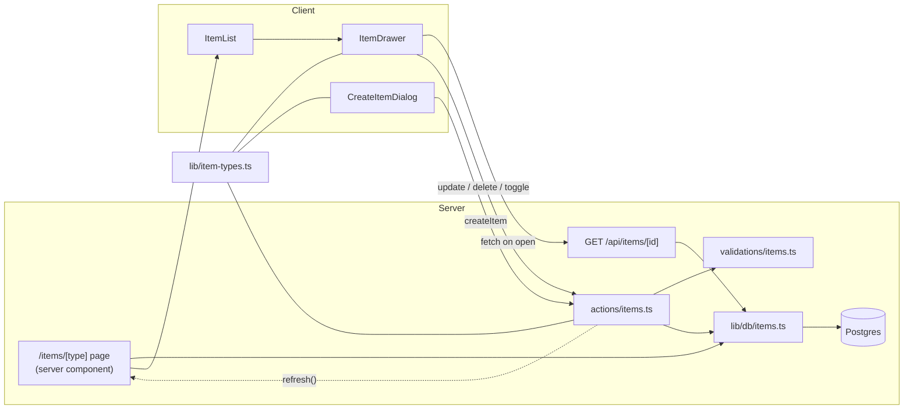

# Item CRUD Architecture

A plan for one create/read/update/delete system that covers all 7 item types. It has three parts:

- **One action file** for all changes to items.
- **One query module** (`lib/db/items.ts`) that server components and the drawer's API route call directly.
- **One dynamic route** (`/items/[type]`), with shared components that change by type.

**Sources:**
- `context/project-overview.md`
- `docs/item-types.md` (the research prompt names `docs/content-types.md`, which doesn't exist; this is the same document)
- `prisma/schema.prisma`
- The current code in `src/`
- The item specs in `context/features/`: `item-list-view`, `item-create`, `item-drawer`, `item-drawer-edit`, `file-image`, `pagination`, `pinned` and `favorites`
- The Next.js 16 docs in `node_modules/next/dist/docs/`

> `src/lib/constants.tsx` doesn't exist. This plan puts the type registry (see [Type registry](#type-registry)) in a new `src/lib/item-types.ts`. It needs no JSX: icons already come from `src/lib/item-type-icons.ts`.

---

## Principles

1. **Types are data, not code paths.** Item types are database rows, and users will be able to add custom types. Code only branches on `contentType` (`TEXT` / `FILE` / `URL`) and on a small per-type field config. Nothing should check `type.name === "snippet"` outside the registry.
2. **Actions are type-agnostic.** `src/actions/items.ts` does the same steps for every type: check auth, validate with Zod, check ownership and plan, call `lib/db`, refresh. The Zod schema follows `contentType`, which the server takes from the item type stored in the database, never from the client.
3. **Type-specific UI lives in components.** Which fields appear, which editor is used and how content is shown are all decided by components that read the registry.
4. **Every query is scoped to the user.** Every `lib/db/items.ts` function takes `userId` and filters on it, so ownership is enforced in the query and not just checked beforehand.

---

## File structure

```
src/
├── actions/
│   └── items.ts                    # NEW: createItem, updateItem, deleteItem,
│                                   #      toggleItemFavorite, toggleItemPin
├── app/
│   ├── items/
│   │   ├── layout.tsx              # NEW: <AppShell> (same as dashboard/profile)
│   │   └── [type]/
│   │       ├── page.tsx            # NEW: list page for one type
│   │       └── loading.tsx         # NEW (optional): skeleton grid
│   └── api/
│       └── items/
│           └── [id]/route.ts       # NEW: GET item detail for the drawer
├── components/
│   └── items/                      # NEW feature folder
│       ├── ItemList.tsx            # client: renders cards, owns drawer state
│       ├── ItemDrawer.tsx          # client: Sheet with view/edit mode
│       ├── ItemDrawerActions.tsx   # favorite / pin / copy / edit / delete bar
│       ├── ItemDetailView.tsx      # read-only body; switches on content kind
│       ├── ItemForm.tsx            # shared create/edit fields, driven by registry
│       ├── CreateItemDialog.tsx    # Dialog + type selector + <ItemForm>
│       ├── DeleteItemDialog.tsx    # AlertDialog confirmation
│       ├── content/                # one renderer per content kind
│       │   ├── TextContent.tsx     # plain <pre>/textarea now; Monaco/Markdown later
│       │   ├── UrlContent.tsx
│       │   └── FileContent.tsx     # later (R2): image preview / file info
│       └── ItemsPagination.tsx     # later (pagination spec)
├── lib/
│   ├── item-types.ts               # NEW: type registry + slug helpers (no DB, no JSX)
│   ├── db/
│   │   └── items.ts                # EXTEND: list/detail/create/update/delete queries
│   └── validations/
│       └── items.ts                # NEW: Zod schemas shared by client and server
└── types/
    └── items.ts                    # NEW (optional): ItemDetail, ItemActionResult, …
```

The existing `components/dashboard/ItemCard.tsx` stays the single card component. It becomes clickable through `ItemList`. Moving it to `components/items/` is optional; leave it where it is unless the move is worth the import churn.

---

## Routing: `/items/[type]`

### Resolving the slug

The slug is the type name, lowercased and pluralized, exactly as the sidebar builds it today with `toPlural()` in `getItemTypesWithCounts()`: `snippet` → `snippets`, `link` → `links`.

```tsx
// src/app/items/[type]/page.tsx (sketch)
export const dynamic = "force-dynamic";

export default async function ItemsByTypePage({ params }: PageProps<"/items/[type]">) {
  const { type: slug } = await params;              // params is a Promise in Next 16
  const userId = await getCurrentUserId();
  if (!userId) redirect(`/sign-in?callbackUrl=/items/${slug}`);

  const type = await getItemTypeBySlug(userId, slug); // system or user's own
  if (!type) notFound();

  const items = await getItemsByType(userId, type.id /*, page */);
  return <ItemList items={items} type={type} />;
}
```

- **`getItemTypeBySlug(userId, slug)`** goes in `lib/db/items.ts`. It loads the system types plus the user's custom types (the same `where` as `getItemTypesWithCounts`) and matches on `slugForType(name)` from `lib/item-types.ts`. Move `toPlural` and the slug logic out of `items.ts` into `item-types.ts`, so the sidebar and the route can't disagree.
- **Slug collisions.** A custom type named `snippet` would have the same slug as the system type, because `@@unique([userId, name])` doesn't apply when `userId` is null. Match system types first. When custom types are built, reject custom names that clash with a system slug.
- **Unknown slug** → `notFound()`. Never fall back to "all items".
- **Auth:** add `"/items/:path*"` (and later `"/collections/:path*"` and `"/favorites"`) to the matcher in `src/proxy.ts`. Keep the page-level `getCurrentUserId()` redirect as well, since the proxy only checks the JWT signature, as the dashboard already notes.
- **Layout:** `src/app/items/layout.tsx` wraps `children` in `AppShell`, like `dashboard/layout.tsx` and `profile/layout.tsx`.
- **Pagination** (later): read `searchParams.page`, query with `skip`/`take` (`ITEMS_PER_PAGE = 21`), and run `count` in parallel. Order by `isPinned desc`, then `updatedAt desc`, so pinned items come first (pinned spec).

### There is no item detail route

As the drawer spec says, the drawer is the detail view. It loads full data from `GET /api/items/[id]`, which calls `getItemDetail(userId, id)` and returns 404 for an item the user doesn't own. This route is the one exception to "client components use Server Actions": it's a read, it's cacheable, and the spec asks for it.

---

## Type registry

`src/lib/item-types.ts` is pure data and can be imported by server code, client code and the Zod schemas. It's the only place that knows about specific type names.

```ts
export type ContentKind = "code" | "markdown" | "url" | "file" | "image";

export interface ItemTypeConfig {
  contentType: ContentType;     // TEXT | FILE | URL — matches the Prisma enum
  kind: ContentKind;            // picks the renderer/editor component
  fields: {
    content?: boolean;
    language?: boolean;
    url?: boolean;
    file?: boolean;
  };
  proOnly?: boolean;            // server-enforced plan gate
  creatable: boolean;           // false for file/image until R2 lands
}

export const SYSTEM_ITEM_TYPES: Record<string, ItemTypeConfig> = {
  snippet: { contentType: "TEXT", kind: "code",     fields: { content: true, language: true }, creatable: true },
  command: { contentType: "TEXT", kind: "code",     fields: { content: true, language: true }, creatable: true },
  prompt:  { contentType: "TEXT", kind: "markdown", fields: { content: true },                 creatable: true },
  note:    { contentType: "TEXT", kind: "markdown", fields: { content: true },                 creatable: true },
  link:    { contentType: "URL",  kind: "url",      fields: { url: true },                     creatable: true },
  image:   { contentType: "FILE", kind: "image",    fields: { file: true },                    creatable: false },
  file:    { contentType: "FILE", kind: "file",     fields: { file: true }, proOnly: true,     creatable: false },
};

// Custom types (Pro) default to a markdown TEXT type until they get their own config
export const DEFAULT_ITEM_TYPE_CONFIG: ItemTypeConfig = { /* TEXT / markdown */ };

export function getItemTypeConfig(type: { name: string; isSystem: boolean }): ItemTypeConfig;
export function slugForType(name: string): string;      // moved from lib/db/items.ts
export function displayNameForType(name: string): string;
```

- `SYSTEM_TYPE_ORDER` and `PRO_SYSTEM_TYPES` in `lib/db/items.ts` should be derived from this registry, so the Pro badge and the server-side gate come from one source. `docs/item-types.md` notes that the sidebar currently badges Image as Pro while the spec says only File is Pro. Settle that here.
- Only `file` should be `proOnly`, per the monetization table. Free users can upload images.

---

## Validation: `src/lib/validations/items.ts`

The schemas are shared, so `ItemForm` can validate on the client and the action stays the source of truth.

```ts
const base = {
  title: z.string().trim().min(1, "Title is required").max(200),
  description: z.string().trim().max(1000).nullish(),     // "" → null in the action
  tags: z.array(z.string().trim().min(1).max(50)).max(20)  // deduped, lowercased
};

export const textItemSchema = z.object({ ...base, contentType: z.literal("TEXT"),
  content: z.string().max(100_000).nullish(), language: z.string().trim().max(50).nullish() });
export const urlItemSchema  = z.object({ ...base, contentType: z.literal("URL"),
  url: z.url("Enter a valid URL") /* restrict to http(s) */ });
export const fileItemSchema = z.object({ ...base, contentType: z.literal("FILE"),
  fileUrl: z.string(), fileName: z.string(), fileSize: z.number().int().positive() }); // later

export const itemInputSchema = z.discriminatedUnion("contentType",
  [textItemSchema, urlItemSchema, fileItemSchema]);

export const createItemSchema = itemInputSchema.and(z.object({ typeId: z.string().min(1) }));
export const updateItemSchema = itemInputSchema;   // type cannot change on edit
```

- The client never chooses `contentType`. The action loads the item type (on create) or the existing item (on update), injects `contentType` from the registry, then parses. A crafted request can't attach a URL to a snippet or skip the URL check.
- Fields that don't belong to the content type are dropped by the schema, and the query writes them as `null`, so a stale `url` can't stay on a TEXT item.
- `tags` arrive as an array. The comma-separated input is split in `ItemForm`, not in the action.

---

## Mutations: `src/actions/items.ts`

One `"use server"` file, following the pattern in `src/actions/profile.ts`:
- `getCurrentUserId()`, returning `NOT_SIGNED_IN` when there's no user
- `safeParse`, returning `fieldErrors` from `z.flattenError`
- a `try/catch` that logs the error and returns `GENERIC_ERROR`
- the `{ success, data, error, fieldErrors }` return shape

```ts
export interface ItemActionResult<T = undefined> {
  success: boolean;
  data?: T;
  error?: string;
  fieldErrors?: Record<string, string[] | undefined>;
}

createItem(input: CreateItemInput):             Promise<ItemActionResult<ItemDetail>>
updateItem(itemId: string, input: UpdateItemInput): Promise<ItemActionResult<ItemDetail>>
deleteItem(itemId: string):                     Promise<ItemActionResult>
toggleItemFavorite(itemId: string):             Promise<ItemActionResult<{ isFavorite: boolean }>>
toggleItemPin(itemId: string):                  Promise<ItemActionResult<{ isPinned: boolean }>>
```

The actions take plain objects, not `FormData`. Tags are an array, and the drawer keeps edits in controlled local state (item-drawer-edit spec).

What each action does, in order:

| Step | create | update | delete | toggles |
| --- | --- | --- | --- | --- |
| 1. Auth | `getCurrentUserId()` | ✓ | ✓ | ✓ |
| 2. Load the type or item, scoped to the user | `getItemTypeForUser(userId, typeId)`: system or owned, else "Invalid type" | `getItemOwnership(userId, id)`, else "Item not found" | — (the scoped delete returns a count) | — |
| 3. Derive `contentType` from the registry and parse with Zod | ✓ | ✓ | — | — |
| 4. Plan checks (server-side) | `proOnly` type + `!isPro` → error; free limit of 50 items (later) | — | — | — |
| 5. Call `lib/db` | `createItem` | `updateItem` | `deleteItem` | `setItemFavorite` / `setItemPin` |
| 6. Side effects | — | — | delete the R2 object if there's a `fileUrl` (later, after the database commit) | — |
| 7. Refresh | `refresh()` from `next/cache` | ✓ | ✓ | ✓ (optimistic in the UI) |

- **Refresh.** Next 16's `refresh()` (`next/cache`, Server Actions only) refreshes the client router from inside the action. That replaces a separate `router.refresh()` in every caller, which the edit spec asks for. Pages are already `force-dynamic`, so `revalidatePath` isn't needed.
- **No per-type branches.** Snippet and note go through exactly the same steps. The only variation is the schema chosen by `contentType` and the `proOnly` flag.
- **Toggles** take no client value. The query flips the stored boolean, so two quick clicks can't get out of sync.

---

## Queries: `src/lib/db/items.ts`

Extend the existing module (`getPinnedItems`, `getRecentItems`, `getItemTypesWithCounts` and `getItemStats` stay as they are). Pages and the API route call these directly. Actions call them after validating.

| Function | Used by | Notes |
| --- | --- | --- |
| `getItemTypeBySlug(userId, slug)` | `/items/[type]` | System types first; uses `slugForType` |
| `getItemTypeForUser(userId, typeId)` | `createItem` | `where: { id, OR: [{ isSystem: true }, { userId }] }` |
| `getItemsByType(userId, typeId, { page })` | `/items/[type]` | `ITEM_CARD_SELECT`; `isPinned desc, updatedAt desc`; `skip/take` + `count` |
| `getItemDetail(userId, id)` | `GET /api/items/[id]`, actions' return value | `ITEM_DETAIL_SELECT`: card fields + `content`, `language`, `url`, file fields, `contentType`, collections `{ id, name }`, `updatedAt` |
| `createItem(userId, typeId, data)` | `createItem` action | Nested `tags: { create: [...] }` with `connectOrCreate` on `Tag @@unique([userId, name])` |
| `updateItem(userId, id, data)` | `updateItem` action | One `$transaction`: update the scalar fields, `tags: { deleteMany: {}, create: [...connectOrCreate] }` (edit spec: replace all tags) |
| `deleteItem(userId, id)` | `deleteItem` action | `deleteMany({ where: { id, userId } })` → returns the count (0 = not found); `ItemTag`/`ItemCollection` rows go with it (cascade). Return `fileUrl` for R2 cleanup |
| `setItemFavorite` / `setItemPin(userId, id)` | toggles | Read and flip inside a transaction, or use `UPDATE … SET "isPinned" = NOT "isPinned"` with `$executeRaw` |

- **Ownership in the `where`.** Prisma's `update` accepts non-unique filters next to `id` (`where: { id, userId }`), so updates throw `P2025` for another user's item. Treat that as "Item not found" and don't reveal that the item exists.
- **Shared mapping.** `toItemWithType` and the defaults (`DEFAULT_TYPE_ICON` and `DEFAULT_TYPE_COLOR`) are reused for detail rows. Add an `ItemDetail` interface next to `ItemWithType`.
- **Orphan tags.** Tags left with no items stay in the database. That's fine for the MVP. Cleaning them up can be its own later task.
- **`lastUsedAt`.** Set it when the user copies an item (the drawer's Copy action), not on every view, so "Recent" means used.

---

## Components and their responsibilities

| Component | Server/Client | Responsibility | Type-aware? |
| --- | --- | --- | --- |
| `app/items/[type]/page.tsx` | Server | Resolve slug → type, auth, fetch the page of items, render the header (icon, name, count) + `ItemList`; empty state | No (data only) |
| `ItemList` | Client | Grid (`md:grid-cols-2`) of `ItemCard`s; holds `selectedItemId` and renders one `ItemDrawer`. Reused on the dashboard for Pinned/Recent and later on collections/favorites | No |
| `ItemCard` (existing) | Server-safe | Displays the type's color/icon, title, markers, tags, date. Wrapped in a button by `ItemList` | Color/icon only |
| `ItemDrawer` | Client | shadcn `Sheet` (right side); fetches `/api/items/[id]` on open, shows a skeleton, toggles view/edit mode, applies optimistic toggles, shows toasts | No |
| `ItemDrawerActions` | Client | Favorite, Pin, Copy (writes `content` or `url`), Edit, Delete; calls the actions | Copy target chosen by `kind` |
| `ItemDetailView` | Client | Title, type badge, description, tags, collections, dates, then `<ContentRenderer kind=…>` | Through the registry |
| `ItemForm` | Client | Controlled inputs for title/description/tags plus the fields listed in `config.fields`; client-side Zod check; Save disabled when the title is empty | Through the registry |
| `CreateItemDialog` | Client | shadcn `Dialog` opened from TopBar's "New Item"; type selector (creatable types, plus the current list page's type as the default), `<ItemForm>`, `createItem`, toast + close | Through the registry |
| `DeleteItemDialog` | Client | `AlertDialog` confirmation → `deleteItem` → closes the drawer, toast | No |
| `content/TextContent` | Client | `kind: "code"` → `<pre>` now, Monaco later (code-editor spec); `kind: "markdown"` → text now, Markdown Write/Preview later | Yes, by `kind` |
| `content/UrlContent` | Server-safe | External link (`rel="noopener noreferrer"`, `target="_blank"`), hostname | Yes |
| `content/FileContent` | Client | Image preview / file info + download (R2 spec, later) | Yes |

**Where type logic lives:** in `lib/item-types.ts` (config) and in the `content/*` and `ItemForm` components (presentation). Actions and queries only ever see `contentType`. A new system type, or a custom type, then needs one registry entry and possibly one renderer. Actions, routes and queries don't change.

**TopBar:** "New Item" needs to open `CreateItemDialog`, so `TopBar` gets a small client child, such as `NewItemButton`, that owns the dialog's state. `TopBar` itself stays a server component.

---

## Data flow



---

## Suggested build order

Each step matches an existing spec:

1. **List view** (`item-list-view-spec`): `item-types.ts`, `getItemTypeBySlug`, `getItemsByType`, `/items/[type]` + layout + proxy matcher.
2. **Drawer** (`item-drawer-spec`): `getItemDetail`, `GET /api/items/[id]`, `ItemList`, `ItemDrawer`, `ItemDetailView` with basic `content/*`.
3. **Edit** (`item-drawer-edit-spec`): `validations/items.ts`, `actions/items.ts#updateItem`, `ItemForm`.
4. **Create** (`item-create-spec`): `createItem`, `CreateItemDialog`, `NewItemButton`.
5. **Delete, favorite and pin** (`favorites-spec`, `pinned-spec`): `deleteItem`, the toggles, optimistic UI.
6. Later: pagination, file/image (R2), and the Monaco/Markdown editors swapped into `content/*`.

---

## Open points

- **Image plan tier:** the sidebar badges Image as Pro, but the spec says Free. Decide this before `proOnly` is enforced.
- **Free tier item limit (50):** count in `createItem` before inserting. Concurrent creates could go slightly over the limit, which is acceptable for the MVP.
- **Custom types:** the registry fallback (`DEFAULT_ITEM_TYPE_CONFIG`) assumes custom types are text/Markdown. A custom type that needs URL or file content needs a stored `contentType` on `ItemType`, which is a schema change for when custom types are built.
- **API route vs action for reading the detail:** the drawer spec chooses an API route. A server action would work too but can't be cached and runs one at a time. Keep the route.
